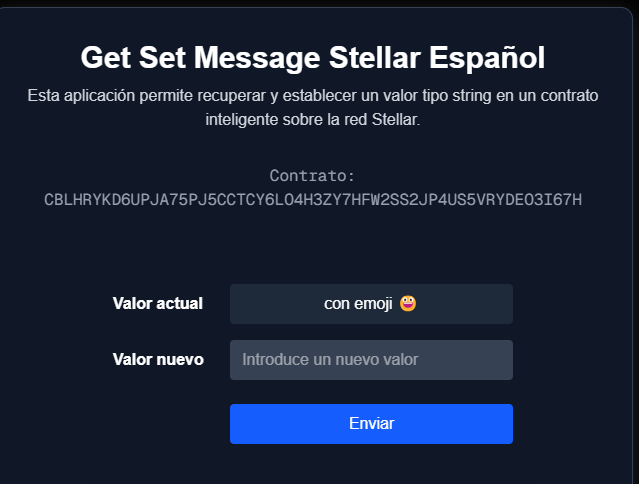

# Get-Set HelloWorld



## Descripción
Este proyecto es un ejemplo ilustrativo y didáctico para aprender los conceptos básicos de React y contratos inteligentes utilizando Next.js. Su objetivo es servir como guía para quienes desean iniciarse en el desarrollo web moderno y la integración con tecnologías blockchain.

## ¿Qué hace este programa?
Permite a los usuarios interactuar con una interfaz sencilla que simula operaciones básicas de lectura y escritura, ideal para comprender la estructura de una aplicación web conectada a contratos inteligentes.

## Instalación y uso

1. **Clonar el repositorio:**

```bash
git clone https://github.com/stellarenespanol/get_set_hello_world.git
cd get-set-helloworld
```

2. **Instalar dependencias:**

```bash
npm install
```

3. **Ejecutar el servidor de desarrollo:**

```bash
npm run dev
```

4. Abre [http://localhost:3000](http://localhost:3000) en tu navegador para ver el resultado.

## Estructura del proyecto
- `src/` Código fuente principal
- `public/` Archivos estáticos e imágenes
- `README.md` Este archivo con instrucciones y descripción

## Contribución
Este proyecto es abierto y cualquier contribución para mejorarlo o ampliarlo es bienvenida.

---

## Learn More

To learn more about Next.js, take a look at the following resources:

- [Next.js Documentation](https://nextjs.org/docs) - learn about Next.js features and API.
- [Learn Next.js](https://nextjs.org/learn) - an interactive Next.js tutorial.

You can check out [the Next.js GitHub repository](https://github.com/vercel/next.js) - your feedback and contributions are welcome!

## Deploy on Vercel

The easiest way to deploy your Next.js app is to use the [Vercel Platform](https://vercel.com/new?utm_medium=default-template&filter=next.js&utm_source=create-next-app&utm_campaign=create-next-app-readme) from the creators of Next.js.

Check out our [Next.js deployment documentation](https://nextjs.org/docs/app/building-your-application/deploying) for more details.
